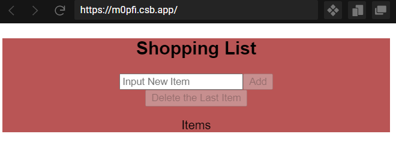
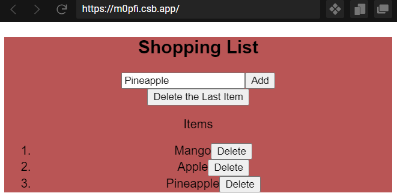
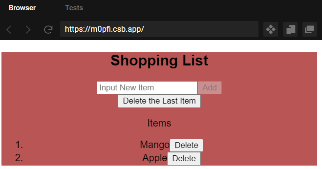
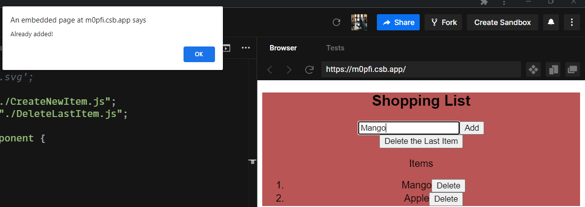
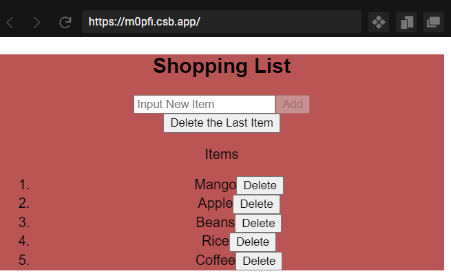
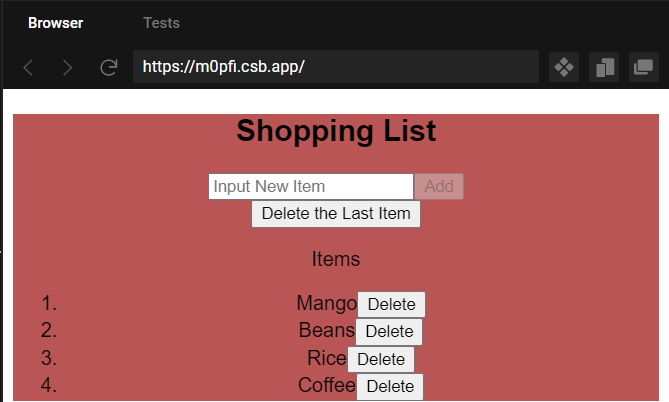

# Shopping_list

## Add, read and delete items from the shopping list. This application was build using React.js, HTML, and CSS 

## video of how the application works.

[Video of the application](asset/video.webm)

| **Screenshots**  | **Screenshots Contd**|
|------------|------------|
|  _No Items Added yet_ |  _Items Added_ |
|  _removed last Item_|  _Trying to add Existing Item_ |
|  _Before Deleteing Apple_ |  _After Deleting Apple_ |

# Thank you